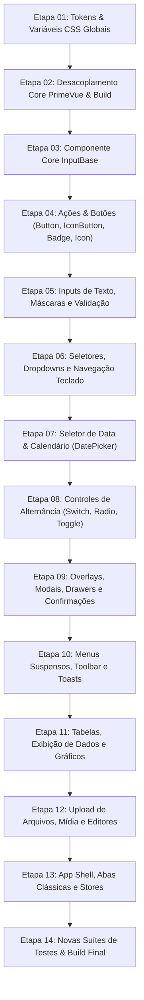

# Prompt Mestre e Guia de Execução: Implementação das Otimizações e Correções da Biblioteca MaxComponentsUi

> **Atenção ao Agente Executor:**  
> Este documento é a instrução canônica de execução para implementar as correções dos 40 achados confirmados durante a auditoria técnica da biblioteca `@maxvue/max-components-ui`.  
> Todas as modificações devem ser executadas exclusivamente na worktree:  
> `/home/johnattas/GitHub/MaxComponentsUi/.max-code-worktrees/wt-653aa895` (branch `wt-653aa895`).  
> **Não troque de branch, não crie outras worktrees e não realize git commit, merge ou push** (essas operações são executadas externamente pelo MaxCode a pedido do usuário).

---

## 1. Protocolo e Regras de Ouro para o Agente Executor

1. **Uso Obrigatório de Subagentes Especialistas**:
   - Para cada uma das 14 etapas descritas neste roteiro, o agente coordenador DEVE invocar subagentes especializados (`self` ou tipos específicos com ferramentas de escrita) para implementar as alterações nos componentes e testes.
   - Cada subagente deve focar exclusivamente nos arquivos designados de sua etapa, consultando os respectivos arquivos `plan.md` em `docs/optimize/{especialista}/{nome_achado}/plan.md`.

2. **Conformidade Estrita com o GEMINI.md**:
   - **Proibição absoluta de classes utilitárias no template**: nunca insira classes como `flex`, `p-10`, `text-center`, `w-full`, etc. no markup. Toda classe deve ser semântica (`.max-*`, `.is-*`).
   - **Obrigatoriedade de `<style lang="scss" scoped>` aninhado**: todos os componentes devem usar `<style lang="scss" scoped>` e a hierarquia dos seletores SCSS deve espelhar estritamente a árvore DOM do template.
   - **Variáveis de Tema**: utilize sempre os tokens `var(--background-*)`, `var(--max-primary-*)`, `var(--max-success-*)`, `var(--max-danger-*)`, etc. Nunca utilize valores literais hexadecimais soltos ou cores hardcoded.

3. **Total Independência do PrimeVue (Zero PrimeVue)**:
   - Nenhum arquivo deve importar pacotes `primevue/*`, `@primevue/*` ou `@primeuix/*`.
   - Nenhuma classe residual `.p-*` deve permanecer nos templates ou regras SCSS (`.p-inputtext`, `.p-select`, `.p-button`, etc.).

4. **Portão de Qualidade por Etapa (Gate Validation)**:
   - Ao final de CADA ETAPA, o agente DEVE executar os comandos de validação antes de avançar para a etapa seguinte:
     ```bash
     npm run type-check
     npx vitest run
     ```
   - Nenhuma etapa pode ser dada como concluída com erros de compilação TypeScript ou falhas em testes unitários.

---

## 2. Mapa das 14 Etapas de Implementação



---

## 3. Detalhamento Operacional Passo a Passo

### Etapa 01: Infraestrutura de Design Tokens, CSS Base e Variáveis de Tema
- **Achados Contemplados**:
  - `docs/optimize/ui-design/hardcoded-colors-and-tailwind-fallbacks/plan.md`
  - `docs/optimize/ui-design/dark-mode-inconsistencies-and-contrast-failures/plan.md`
  - `docs/optimize/usabilidade/ausencia-indicadores-foco-visivel-focus-visible/plan.md` (tokens)
- **Arquivos Afetados**:
  - [`src/themes/tokens.scss`](file:///home/johnattas/GitHub/MaxComponentsUi/.max-code-worktrees/wt-653aa895/src/themes/tokens.scss)
  - [`src/themes/colors.scss`](file:///home/johnattas/GitHub/MaxComponentsUi/.max-code-worktrees/wt-653aa895/src/themes/colors.scss)
  - [`src/themes/params.scss`](file:///home/johnattas/GitHub/MaxComponentsUi/.max-code-worktrees/wt-653aa895/src/themes/params.scss)
- **Instruções para o Subagente**:
  1. No `tokens.scss`:
     - Definir tokens canônicos de foco acessível: `--max-focus-ring: 0 0 0 2px var(--background-0), 0 0 0 4px var(--max-primary-500);` e `--max-focus-outline: 2px solid var(--max-primary-500);`.
     - Definir tokens de severidade: `--max-success-600: #059669;`, `--max-danger-600: #dc2626;`, `--max-warning-600: #d97706;`, `--max-info-600: #0284c7;`.
     - No bloco `.dark`, ajustar tokens de contraste para que `--background-800` e `--background-900` tenham contraste real contra texto branco.
  2. No `params.scss`:
     - Remover overrides arbitrários de debug (`--max-form-field-disabled-background: red !important;`).
     - Normalizar seletores globais sem quebrar contratos de atributo.
- **Validação da Etapa**:
  ```bash
  npm run type-check && npx vitest run tests/themes/
  ```

---

### Etapa 02: Desacoplamento Total do PrimeVue no Core, Resolver e Build
- **Achados Contemplados**:
  - `docs/optimize/testes-estabilidade/acoplamento-primevue-core-barrel-install/plan.md`
  - `docs/optimize/testes-estabilidade/acoplamento-primevue-entrypoint-prime-resolver/plan.md`
- **Arquivos Afetados**:
  - [`src/index.ts`](file:///home/johnattas/GitHub/MaxComponentsUi/.max-code-worktrees/wt-653aa895/src/index.ts)
  - [`src/styles/style.ts`](file:///home/johnattas/GitHub/MaxComponentsUi/.max-code-worktrees/wt-653aa895/src/styles/style.ts)
  - [`src/helpers/MaxComponentsUiResolver.ts`](file:///home/johnattas/GitHub/MaxComponentsUi/.max-code-worktrees/wt-653aa895/src/helpers/MaxComponentsUiResolver.ts)
  - [`src/prime/index.ts`](file:///home/johnattas/GitHub/MaxComponentsUi/.max-code-worktrees/wt-653aa895/src/prime/index.ts)
  - [`package.json`](file:///home/johnattas/GitHub/MaxComponentsUi/.max-code-worktrees/wt-653aa895/package.json)
  - [`vite.config.ts`](file:///home/johnattas/GitHub/MaxComponentsUi/.max-code-worktrees/wt-653aa895/vite.config.ts)
  - [`src/scripts/generateResolver.ts`](file:///home/johnattas/GitHub/MaxComponentsUi/.max-code-worktrees/wt-653aa895/src/scripts/generateResolver.ts)
- **Instruções para o Subagente**:
  1. Em `src/index.ts`: remover `import PrimeVue from 'primevue/config'`, remover `app.use(PrimeVue)`. Tipar a função de instalação como `install(app: App, options?: MaxPluginOptions)`. Registrar diretiva `v-tooltip` nativa da biblioteca.
  2. Em `src/styles/style.ts`: remover imports de `@primeuix/themes` e `@primeuix/themes/aura`. Exportar `MaxStyle` como objeto TypeScript semântico próprio do design system.
  3. Em `src/helpers/MaxComponentsUiResolver.ts`: remover import e uso de `@primevue/auto-import-resolver`. O resolver deve resolver unicamente componentes `@maxvue/max-components-ui` com base no `components-manifest.json`.
  4. Em `src/prime/index.ts`: descontinuar a reexportação crua de componentes do PrimeVue ou isolar como mock de compatibilidade interna.
  5. Em `package.json` e `vite.config.ts`: remover o entrypoint secundário `prime` e remover dependências de PrimeVue.
- **Validação da Etapa**:
  ```bash
  npm run type-check && npm run build
  ```

---

### Etapa 03: Componente Core `InputBase` e Padronização de Feedback
- **Achados Contemplados**:
  - `docs/optimize/ux/inputbase-feedback-message-hidden/plan.md`
  - `docs/optimize/ui-design/primevue-residual-classes-and-selectors/plan.md` (regras InputBase)
  - `docs/optimize/ui-design/utility-classes-and-inline-styles-in-templates/plan.md` (InputBase)
  - `docs/optimize/testes-estabilidade/uso-indiscriminado-any-contratos-props-inconsistentes/plan.md` (InputBase)
- **Arquivo Afetado**:
  - [`src/components/InputBase.vue`](file:///home/johnattas/GitHub/MaxComponentsUi/.max-code-worktrees/wt-653aa895/src/components/InputBase.vue)
- **Instruções para o Subagente**:
  1. Corrigir visibilidade de `.input-message`: remover `display: none;` fixo, definindo `display: flex; align-items: center; gap: 4px;` com transição suave, garantindo que mensagens de erro, caution e info apareçam de fato abaixo do campo.
  2. Substituir interpolações de strings de classes utilitárias no template por classes semânticas BEM (`.is-text-center`, `.is-text-right`, `.is-done`, `.is-caution`, `.is-error`, `.is-float`, `.is-inline`).
  3. Refatorar os 41 seletores `:deep(.p-*)` substituindo-os por classes semânticas nativas (`.max-input-native`, `.max-select-trigger`, etc.), mantendo seletores transitórios para evitar regressões.
  4. Tipar estritamente as props de valor e opções: substituir `value?: any`, `modelValue?: any`, `options?: any[]` por tipos e generics bem definidos.
- **Validação da Etapa**:
  ```bash
  npm run type-check && npx vitest run tests/components/InputBase.test.ts
  ```

---

### Etapa 04: Componentes Fundacionais de Ação e Interação
- **Achados Contemplados**:
  - `docs/optimize/usabilidade/falha-critica-acessibilidade-max-icon-button/plan.md`
  - `docs/optimize/usabilidade/ausencia-indicadores-foco-visivel-focus-visible/plan.md` (MaxButton)
  - `docs/optimize/performance/icon-use-element-hover-overhead/plan.md`
  - `docs/optimize/performance/mutation-observer-per-badge/plan.md`
- **Arquivos Afetados**:
  - [`src/components/MaxIconButton.vue`](file:///home/johnattas/GitHub/MaxComponentsUi/.max-code-worktrees/wt-653aa895/src/components/MaxIconButton.vue)
  - [`src/components/MaxButton.vue`](file:///home/johnattas/GitHub/MaxComponentsUi/.max-code-worktrees/wt-653aa895/src/components/MaxButton.vue)
  - [`src/components/MaxBadge.vue`](file:///home/johnattas/GitHub/MaxComponentsUi/.max-code-worktrees/wt-653aa895/src/components/MaxBadge.vue)
  - [`src/components/MaxIcon.vue`](file:///home/johnattas/GitHub/MaxComponentsUi/.max-code-worktrees/wt-653aa895/src/components/MaxIcon.vue)
- **Instruções para o Subagente**:
  1. `MaxIconButton.vue`: migrar a raiz de `<div>` para `<button type="button">`, adicionar suporte a `:focus-visible`, cálculo de `aria-label` e touch target seguro via pseudo-elemento `::after`.
  2. `MaxButton.vue`: adicionar anel de foco `:focus-visible` para todas as variantes (solid, outlined, text, link, dashed). Corrigir contraste da variante `contrast` sob dark mode.
  3. `MaxBadge.vue`: remover a criação de `new MutationObserver` por instância; consumir o estado de dark mode de forma centralizada ou via media query / classe CSS direta.
  4. `MaxIcon.vue`: tornar o uso de `useElementHover` condicional (apenas quando `hoverColor` ou `attrs.pointer` forem definidos), evitando milhares de listeners inativos.
- **Validação da Etapa**:
  ```bash
  npm run type-check && npx vitest run tests/components/MaxButton.test.ts tests/components/MaxIconButton.test.ts tests/components/MaxBadge.test.ts tests/components/MaxIcon.test.ts
  ```

---

### Etapa 05: Controles de Formulário — Inputs de Texto, Máscaras e Validação
- **Achados Contemplados**:
  - `docs/optimize/ux/inputs-eager-validation-and-mobile-affordance/plan.md`
  - `docs/optimize/testes-estabilidade/ausencia-tipagem-estrita-define-emits-inputs/plan.md` (inputs de texto)
  - `docs/optimize/ui-design/primevue-residual-classes-and-selectors/plan.md` (inputs)
  - `docs/optimize/ui-design/utility-classes-and-inline-styles-in-templates/plan.md` (MaxInputCpfCnpj)
- **Arquivos Afetados**:
  - [`src/components/MaxInputText.vue`](file:///home/johnattas/GitHub/MaxComponentsUi/.max-code-worktrees/wt-653aa895/src/components/MaxInputText.vue)
  - [`src/components/MaxInputTextArea.vue`](file:///home/johnattas/GitHub/MaxComponentsUi/.max-code-worktrees/wt-653aa895/src/components/MaxInputTextArea.vue)
  - [`src/components/MaxInputCep.vue`](file:///home/johnattas/GitHub/MaxComponentsUi/.max-code-worktrees/wt-653aa895/src/components/MaxInputCep.vue)
  - [`src/components/MaxInputCpfCnpj.vue`](file:///home/johnattas/GitHub/MaxComponentsUi/.max-code-worktrees/wt-653aa895/src/components/MaxInputCpfCnpj.vue)
  - [`src/components/MaxInputPhone.vue`](file:///home/johnattas/GitHub/MaxComponentsUi/.max-code-worktrees/wt-653aa895/src/components/MaxInputPhone.vue)
  - [`src/components/MaxInputPhoneMail.vue`](file:///home/johnattas/GitHub/MaxComponentsUi/.max-code-worktrees/wt-653aa895/src/components/MaxInputPhoneMail.vue)
  - [`src/components/MaxInputNumber.vue`](file:///home/johnattas/GitHub/MaxComponentsUi/.max-code-worktrees/wt-653aa895/src/components/MaxInputNumber.vue)
  - [`src/components/MaxInputSearch.vue`](file:///home/johnattas/GitHub/MaxComponentsUi/.max-code-worktrees/wt-653aa895/src/components/MaxInputSearch.vue)
  - [`src/components/MaxInputOTP.vue`](file:///home/johnattas/GitHub/MaxComponentsUi/.max-code-worktrees/wt-653aa895/src/components/MaxInputOTP.vue)
  - [`src/components/MaxInputTextList.vue`](file:///home/johnattas/GitHub/MaxComponentsUi/.max-code-worktrees/wt-653aa895/src/components/MaxInputTextList.vue)
- **Instruções para o Subagente**:
  1. Remover as classes PrimeVue (`class="p-inputtext p-component"`) dos elementos `<input>` nativos e adotar `.max-input-native`.
  2. Substituir `defineEmits(['update:modelValue'])` pela sintaxe de tuplas estritas `defineEmits<{ 'update:modelValue': [val: string]; ... }>()`.
  3. No `MaxInputCpfCnpj`: diferir a mensagem de erro para o evento `blur` ou após a conclusão da máscara; mover o estilo `:style="'letter-spacing: 2.5px;'"` para classe SCSS scoped `.is-formatted`.
  4. No `MaxInputPhone`: corrigir a concatenação errônea do rótulo `"Telefonefalse"` e adicionar `type="tel"` / `inputmode="tel"`.
  5. No `MaxInputCep`: corrigir o ícone de carregamento para `'line-md:loading-loop'`.
  6. No `MaxInputOTP`: adicionar `role="group"` e `aria-label="Dígito X de Y"`.
- **Validação da Etapa**:
  ```bash
  npm run type-check && npx vitest run tests/components/MaxInputText.test.ts tests/components/MaxInputCpfCnpj.test.ts tests/components/MaxInputCep.test.ts tests/components/MaxInputPhone.test.ts tests/components/MaxInputOTP.test.ts
  ```

---

### Etapa 06: Controles de Formulário — Seleção, Dropdowns e Navegação por Teclado
- **Achados Contemplados**:
  - `docs/optimize/usabilidade/ausencia-navegacao-por-setas-e-selecao-em-selects/plan.md`
  - `docs/optimize/ux/select-clearability-and-keyboard-navigation/plan.md`
  - `docs/optimize/performance/global-keydown-listener-storm/plan.md` (selects)
  - `docs/optimize/ui-design/primevue-residual-classes-and-selectors/plan.md` (selects)
- **Arquivos Afetados**:
  - [`src/components/MaxInputSelect.vue`](file:///home/johnattas/GitHub/MaxComponentsUi/.max-code-worktrees/wt-653aa895/src/components/MaxInputSelect.vue)
  - [`src/components/MaxTagSelect.vue`](file:///home/johnattas/GitHub/MaxComponentsUi/.max-code-worktrees/wt-653aa895/src/components/MaxTagSelect.vue)
  - [`src/components/MaxListBox.vue`](file:///home/johnattas/GitHub/MaxComponentsUi/.max-code-worktrees/wt-653aa895/src/components/MaxListBox.vue)
  - [`src/components/MaxTagsList.vue`](file:///home/johnattas/GitHub/MaxComponentsUi/.max-code-worktrees/wt-653aa895/src/components/MaxTagsList.vue)
- **Instruções para o Subagente**:
  1. Corrigir navegação por teclado: permitir que `ArrowDown` e `ArrowUp` naveguem pelas opções da lista suspensa aberta, com `highlightedIndex`, `aria-activedescendant` e seleção via `Enter`.
  2. Implementar prop `clearable?: boolean` com botão "X" de limpeza rápida e evento `@clear`.
  3. Eliminar o listener global `window.addEventListener('keydown')` permanente: registrar o ouvinte **apenas** quando o dropdown estiver aberto (`isOpen === true`) e remover imediatamente ao fechar.
  4. Remover classes e seletores `.p-select*`, adotando marcação semântica própria `.max-select*`.
- **Validação da Etapa**:
  ```bash
  npm run type-check && npx vitest run tests/components/MaxInputSelect.test.ts tests/components/MaxTagSelect.test.ts tests/components/MaxListBox.test.ts
  ```

---

### Etapa 07: Controles de Formulário — Seletor de Data & Calendário
- **Achados Contemplados**:
  - `docs/optimize/ux/datepicker-historical-navigation-and-range-constraints/plan.md`
  - `docs/optimize/usabilidade/ausencia-de-rotulos-acessiveis-e-papeis-em-max-datepicker-e-tabelas/plan.md`
  - `docs/optimize/performance/global-keydown-listener-storm/plan.md` (DatePicker)
- **Arquivo Afetado**:
  - [`src/components/MaxInputDatePicker.vue`](file:///home/johnattas/GitHub/MaxComponentsUi/.max-code-worktrees/wt-653aa895/src/components/MaxInputDatePicker.vue)
- **Instruções para o Subagente**:
  1. Implementar navegação rápida por Vistas: alternância entre Dias, Meses e Anos (década) clicando no cabeçalho.
  2. Suporte às props `minDate` e `maxDate` com desabilitação visual e restrição de seleção.
  3. Adicionar padrão WAI-ARIA Grid (`role="grid"`, `role="row"`, `role="gridcell"`) e `aria-label` nos botões de navegação de mês ("Mês anterior" / "Próximo mês").
  4. Vincular o ouvinte global de `Escape`/`keydown` apenas quando o popup estiver aberto.
  5. Remover resíduos de classes PrimeVue (`.p-datepicker*`).
- **Validação da Etapa**:
  ```bash
  npm run type-check && npx vitest run tests/components/MaxInputDatePicker.test.ts
  ```

---

### Etapa 08: Controles de Formulário — Alternâncias Binárias e Toggles
- **Achados Contemplados**:
  - `docs/optimize/usabilidade/falta-acessibilidade-e-navegacao-teclado-max-input-switch/plan.md`
  - `docs/optimize/ux/form-controls-disabled-affordance-and-a11y/plan.md`
- **Arquivos Afetados**:
  - [`src/components/MaxInputSwitch.vue`](file:///home/johnattas/GitHub/MaxComponentsUi/.max-code-worktrees/wt-653aa895/src/components/MaxInputSwitch.vue)
  - [`src/components/MaxInputRadio.vue`](file:///home/johnattas/GitHub/MaxComponentsUi/.max-code-worktrees/wt-653aa895/src/components/MaxInputRadio.vue)
  - [`src/components/MaxInputToggle.vue`](file:///home/johnattas/GitHub/MaxComponentsUi/.max-code-worktrees/wt-653aa895/src/components/MaxInputToggle.vue)
- **Instruções para o Subagente**:
  1. `MaxInputSwitch.vue`: adicionar `role="switch"`, `:aria-checked="modelValue"`, `tabindex="0"`, acionamento por teclado (`Enter`/`Espaço`) e estilo visual de estado desabilitado (`opacity: 0.5; cursor: not-allowed;`).
  2. `MaxInputRadio.vue`: bloquear alteração de estado no manipulador de clique externo quando `disabled: true`.
  3. `MaxInputToggle.vue`: associar formalmente o rótulo ao input de checkbox via atributos `id` e `for`.
- **Validação da Etapa**:
  ```bash
  npm run type-check && npx vitest run tests/components/MaxInputSwitch.test.ts tests/components/MaxInputRadio.test.ts tests/components/MaxInputToggle.test.ts
  ```

---

### Etapa 09: Overlays, Modais, Drawers e Diálogos de Confirmação
- **Achados Contemplados**:
  - `docs/optimize/ux/modal-accidental-close-data-loss/plan.md`
  - `docs/optimize/ux/confirm-dialog-button-hierarchy/plan.md`
  - `docs/optimize/usabilidade/inconsistencias-aria-e-restauracao-foco-em-overlays-e-drawers/plan.md`
  - `docs/optimize/performance/memory-leak-focus-trap-drawer/plan.md`
  - `docs/optimize/performance/overlay-unthrottled-scroll-reposition/plan.md`
- **Arquivos Afetados**:
  - [`src/components/MaxModal.vue`](file:///home/johnattas/GitHub/MaxComponentsUi/.max-code-worktrees/wt-653aa895/src/components/MaxModal.vue)
  - [`src/components/MaxDrawer.vue`](file:///home/johnattas/GitHub/MaxComponentsUi/.max-code-worktrees/wt-653aa895/src/components/MaxDrawer.vue)
  - [`src/components/MaxPopoverConfirm.vue`](file:///home/johnattas/GitHub/MaxComponentsUi/.max-code-worktrees/wt-653aa895/src/components/MaxPopoverConfirm.vue)
  - [`src/components/MaxButtonConfirm.vue`](file:///home/johnattas/GitHub/MaxComponentsUi/.max-code-worktrees/wt-653aa895/src/components/MaxButtonConfirm.vue)
  - [`src/components/MaxIconConfirm.vue`](file:///home/johnattas/GitHub/MaxComponentsUi/.max-code-worktrees/wt-653aa895/src/components/MaxIconConfirm.vue)
  - [`src/components/base/MaxBaseOverlay.vue`](file:///home/johnattas/GitHub/MaxComponentsUi/.max-code-worktrees/wt-653aa895/src/components/base/MaxBaseOverlay.vue)
  - [`src/composables/useFocusTrap.ts`](file:///home/johnattas/GitHub/MaxComponentsUi/.max-code-worktrees/wt-653aa895/src/composables/useFocusTrap.ts)
- **Instruções para o Subagente**:
  1. `MaxModal.vue`: adicionar prop `dismissable?: boolean` (default: `true`), animação de shake ao clicar fora em modal não dispensável, e ajustar `blockScroll` default para `true`.
  2. `MaxPopoverConfirm.vue`: estabelecer hierarquia visual (botão rejeitar como outlined/secondary, botão aceitar com a severidade da ação). Adicionar suporte a `severity` e `variant` nas interfaces.
  3. `MaxDrawer.vue`: alterar `role="complementary"` para `role="dialog"` com `aria-modal="true"` e `aria-labelledby`. Garantir invocação de `trap.deactivate()` no `onBeforeUnmount` para eliminar vazamento de memória.
  4. `MaxBaseOverlay.vue`: aplicar throttle com `requestAnimationFrame` no ouvinte de scroll global para eliminar layout thrashing.
- **Validação da Etapa**:
  ```bash
  npm run type-check && npx vitest run tests/components/MaxModal.test.ts tests/components/MaxDrawer.test.ts tests/components/MaxPopoverConfirm.test.ts
  ```

---

### Etapa 10: Menus Suspensos, Toolbar e Sistema de Notificações (Toast)
- **Achados Contemplados**:
  - `docs/optimize/usabilidade/violacao-padrao-aria-e-teclado-em-popover-menu-e-toolbar/plan.md`
  - `docs/optimize/ux/toast-error-persistence-and-truncation/plan.md`
  - `docs/optimize/performance/global-keydown-listener-storm/plan.md` (menus)
- **Arquivos Afetados**:
  - [`src/components/MaxPopoverMenu.vue`](file:///home/johnattas/GitHub/MaxComponentsUi/.max-code-worktrees/wt-653aa895/src/components/MaxPopoverMenu.vue)
  - [`src/components/MaxUserSection.vue`](file:///home/johnattas/GitHub/MaxComponentsUi/.max-code-worktrees/wt-653aa895/src/components/MaxUserSection.vue)
  - [`src/components/MaxTopToolbar.vue`](file:///home/johnattas/GitHub/MaxComponentsUi/.max-code-worktrees/wt-653aa895/src/components/MaxTopToolbar.vue)
  - [`src/components/MaxToast.vue`](file:///home/johnattas/GitHub/MaxComponentsUi/.max-code-worktrees/wt-653aa895/src/components/MaxToast.vue)
  - [`src/stores/useToast.Store.ts`](file:///home/johnattas/GitHub/MaxComponentsUi/.max-code-worktrees/wt-653aa895/src/stores/useToast.Store.ts)
- **Instruções para o Subagente**:
  1. `MaxPopoverMenu.vue` e `MaxUserSection.vue`: implementar WAI-ARIA Menu completo, roving tabindex nas opções, navegação por setas e ativação por teclado. Eliminar IDs estáticos duplicados.
  2. `MaxTopToolbar.vue`: permitir acionamento de submenus via teclado além do hover de mouse.
  3. `MaxToast.vue` e `useToast.Store.ts`: suportar `duration: 0` para toasts permanentes; adicionar botão de expansão "Ver mais" para mensagens longas de erro; remover `clear()` agressivo no desmonte do componente para manter notificações vivas entre rotas.
- **Validação da Etapa**:
  ```bash
  npm run type-check && npx vitest run tests/components/MaxToast.test.ts tests/components/MaxPopoverMenu.test.ts tests/stores/useToastStore.test.ts
  ```

---

### Etapa 11: Tabelas, Exibição de Dados e Gráficos
- **Achados Contemplados**:
  - `docs/optimize/ux/table-loading-and-empty-state-flicker/plan.md`
  - `docs/optimize/testes-estabilidade/resiliencia-props-nulas-risco-crash-renderizacao/plan.md` (tabelas)
  - `docs/optimize/performance/chart-canvas-recreation-on-data-change/plan.md`
- **Arquivos Afetados**:
  - [`src/components/MaxTable.vue`](file:///home/johnattas/GitHub/MaxComponentsUi/.max-code-worktrees/wt-653aa895/src/components/MaxTable.vue)
  - [`src/components/MaxTableFields.vue`](file:///home/johnattas/GitHub/MaxComponentsUi/.max-code-worktrees/wt-653aa895/src/components/MaxTableFields.vue)
  - [`src/components/MaxChart.vue`](file:///home/johnattas/GitHub/MaxComponentsUi/.max-code-worktrees/wt-653aa895/src/components/MaxChart.vue)
  - [`src/components/MaxStats.vue`](file:///home/johnattas/GitHub/MaxComponentsUi/.max-code-worktrees/wt-653aa895/src/components/MaxStats.vue)
- **Instruções para o Subagente**:
  1. `MaxTable.vue` e `MaxTableFields.vue`: adicionar suporte à prop `loading?: boolean` com spinner dedicado; normalizar default de `list` para `() => []`; proteger cálculo de `totalColspan` contra `columns` indefinido.
  2. `MaxChart.vue`: atualizar dados no watcher através de `chartInstance.data = newData; chartInstance.update()` em vez de destruir o canvas e reinicializar toda a biblioteca Chart.js.
- **Validação da Etapa**:
  ```bash
  npm run type-check && npx vitest run tests/components/MaxTable.test.ts tests/components/MaxTableFields.test.ts tests/components/MaxChart.test.ts
  ```

---

### Etapa 12: Upload de Arquivos, Mídia e Editores Especiais
- **Achados Contemplados**:
  - `docs/optimize/ux/fileupload-missing-deletion-and-metadata-feedback/plan.md`
  - `docs/optimize/usabilidade/barreiras-de-acessibilidade-em-upload-de-arquivos-e-icon-picker/plan.md`
  - `docs/optimize/performance/markdown-serialization-keystroke-lag/plan.md`
  - `docs/optimize/performance/svg-icon-picker-cache-wipe-and-leak/plan.md`
- **Arquivos Afetados**:
  - [`src/components/MaxInputFileUpload.vue`](file:///home/johnattas/GitHub/MaxComponentsUi/.max-code-worktrees/wt-653aa895/src/components/MaxInputFileUpload.vue)
  - [`src/components/MaxInputFileUploadBig.vue`](file:///home/johnattas/GitHub/MaxComponentsUi/.max-code-worktrees/wt-653aa895/src/components/MaxInputFileUploadBig.vue)
  - [`src/components/MaxInputIconPicker.vue`](file:///home/johnattas/GitHub/MaxComponentsUi/.max-code-worktrees/wt-653aa895/src/components/MaxInputIconPicker.vue)
  - [`src/components/MaxInputMarkdown.vue`](file:///home/johnattas/GitHub/MaxComponentsUi/.max-code-worktrees/wt-653aa895/src/components/MaxInputMarkdown.vue)
  - [`src/components/MaxPdfView.vue`](file:///home/johnattas/GitHub/MaxComponentsUi/.max-code-worktrees/wt-653aa895/src/components/MaxPdfView.vue)
- **Instruções para o Subagente**:
  1. `MaxInputFileUpload.vue`: adicionar botão de exclusão/remoção por arquivo, exibição de nome/tamanho e suporte a ícones de documentos de escritório (`.docx`, `.xlsx`, `.zip`).
  2. `MaxInputFileUploadBig.vue`: tornar o container focável por teclado (`tabindex="0"`), com suporte a `Enter`/`Espaço` e `aria-label`.
  3. `MaxInputMarkdown.vue`: aplicar debounce e flag de sincronização interna para evitar dupla serialização recursiva AST a cada tecla.
  4. `MaxInputIconPicker.vue`: preservar o cache de SVGs entre aberturas da gaveta, limpar timers no desmonte e tornar as células da grade acessíveis por teclado.
- **Validação da Etapa**:
  ```bash
  npm run type-check && npx vitest run tests/components/MaxInputFileUpload.test.ts tests/components/MaxInputMarkdown.test.ts
  ```

---

### Etapa 13: App Shell, Abas Clássicas e Stores Globais
- **Achados Contemplados**:
  - `docs/optimize/usabilidade/inacessibilidade-no-modo-classico-max-tab-item/plan.md`
  - `docs/optimize/testes-estabilidade/resiliencia-props-nulas-risco-crash-renderizacao/plan.md` (MaxBottomMenu)
  - `docs/optimize/performance/icon-store-unbatched-indexeddb-serialization/plan.md`
  - `docs/optimize/ui-design/scss-nesting-and-dom-hierarchy-violations/plan.md` (títulos e searchbar)
- **Arquivos Afetados**:
  - [`src/components/MaxTabItem.vue`](file:///home/johnattas/GitHub/MaxComponentsUi/.max-code-worktrees/wt-653aa895/src/components/MaxTabItem.vue)
  - [`src/components/MaxBottomMenu.vue`](file:///home/johnattas/GitHub/MaxComponentsUi/.max-code-worktrees/wt-653aa895/src/components/MaxBottomMenu.vue)
  - [`src/components/MaxTopMenuSearchBar.vue`](file:///home/johnattas/GitHub/MaxComponentsUi/.max-code-worktrees/wt-653aa895/src/components/MaxTopMenuSearchBar.vue)
  - [`src/components/MaxTitle1.vue`](file:///home/johnattas/GitHub/MaxComponentsUi/.max-code-worktrees/wt-653aa895/src/components/MaxTitle1.vue)
  - [`src/components/MaxTitle2.vue`](file:///home/johnattas/GitHub/MaxComponentsUi/.max-code-worktrees/wt-653aa895/src/components/MaxTitle2.vue)
  - [`src/stores/useIcon.Store.ts`](file:///home/johnattas/GitHub/MaxComponentsUi/.max-code-worktrees/wt-653aa895/src/stores/useIcon.Store.ts)
- **Instruções para o Subagente**:
  1. `MaxTabItem.vue`: adicionar padrão WAI-ARIA no modo clássico (`role="tab"`, `role="tabpanel"`, setas de navegação) sem alterar a reatividade com `v-if`.
  2. `MaxBottomMenu.vue`: adicionar computada defensiva `safeTabs` para prevenir crash quando `props.tabs` for nulo ou indefinido.
  3. `useIcon.Store.ts`: agrupar gravações no IndexedDB em lote único (`batch save`) ao resolver múltiplos ícones.
  4. `MaxTitle1.vue`, `MaxTitle2.vue` e `MaxTopMenuSearchBar.vue`: reestruturar blocos SCSS scoped aninhados espelhando fielmente a hierarquia do template.
- **Validação da Etapa**:
  ```bash
  npm run type-check && npx vitest run tests/components/MaxTabItem.test.ts tests/components/MaxBottomMenu.test.ts tests/stores/useIconStore.test.ts
  ```

---

### Etapa 14: Novas Suítes de Testes Unitários, Regeneração e Build Final
- **Achados Contemplados**:
  - `docs/optimize/testes-estabilidade/cobertura-testes-componentes-criticos-sem-testes/plan.md`
- **Arquivos a Criar**:
  - `tests/components/MaxAccordionItem.test.ts`
  - `tests/components/MaxTabList.test.ts`
  - `tests/components/MaxTabPanel.test.ts`
  - `tests/components/MaxTabPanels.test.ts`
  - `tests/components/MaxTopToolbar.test.ts`
  - `tests/components/MaxTopMenuSearchBar.test.ts`
  - `tests/components/MaxMenuVerticalItem.test.ts`
  - `tests/components/MaxContainerApp.test.ts`
  - `tests/components/MaxLoadScreenTarget.test.ts`
- **Instruções para o Subagente**:
  1. Implementar cada arquivo de teste cobrindo montagem, injeções de contexto (`provide`/`inject`), slots e propriedades.
  2. Regenerar o manifesto de componentes:
     ```bash
     npx tsx src/scripts/generateResolver.ts
     ```
  3. Executar a verificação integral da biblioteca:
     ```bash
     npm run type-check
     npm run lint
     npm test
     npm run build
     ```
- **Critério de Sucesso**:
  - 0 erros de compilação TypeScript (`vue-tsc`).
  - 0 violações de ESLint e Stylelint.
  - 100% dos testes unitários aprovados no Vitest.
  - Build das quatro entradas ES finalizado com sucesso em `dist/`.

---

## 4. Guia de Conclusão para o Agente Executor

Ao término da Etapa 14, o agente executor deve:
1. Executar `git status` para certificar que todos os arquivos modificados e gerados estão restritos à worktree designada.
2. Emitir um relatório final listando as 14 etapas executadas, o número de componentes aprimorados e o status dos testes automatizados.
3. Não realizar commits nem merge: avisar ao usuário que a biblioteca está 100% otimizada, independente e pronta para homologação.
